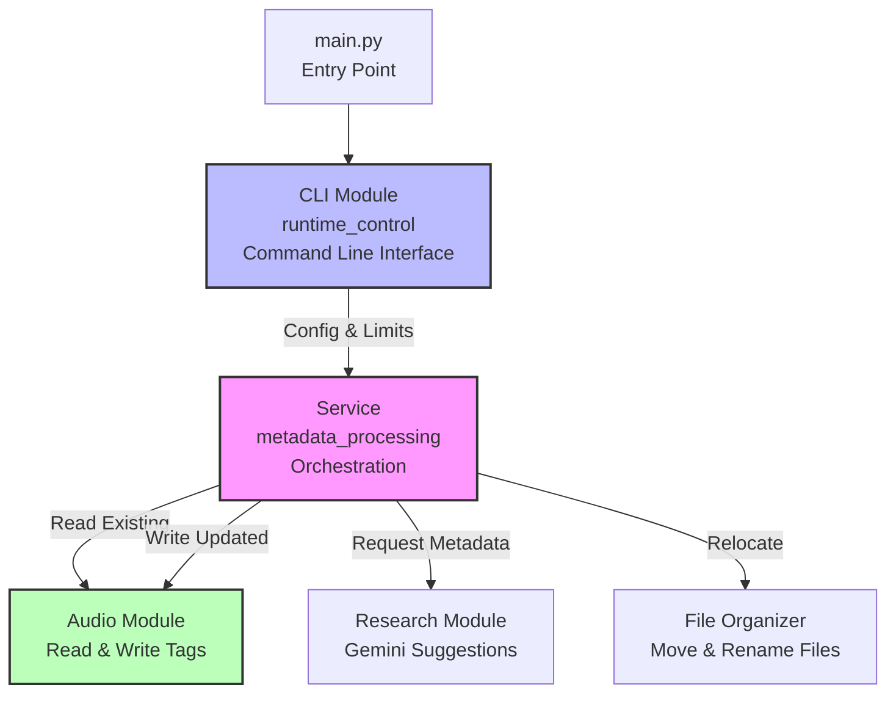

# Music Metadata Checker

This project scans a music library, reads existing audio tags, sends batches of tracks to Gemini for metadata suggestions, then writes tags and optionally relocates files into a target folder structure.

The implementation lives in the `music_metadata` package. `main.py` is only a thin entrypoint that calls the CLI module.

## Actual Project Structure

```text
.
|- main.py
|- README.md
|- requirements.txt
|- .env.example
|- docs/
|  |- code/
|  |  |- 01-package-and-entry/
|  |  |  |- __init__.md
|  |  |  |- main.md
|  |  |- 02-runtime-control/
|  |  |  |- cli.md
|  |  |  |- config.md
|  |  |  |- types.md
|  |  |- 03-metadata-processing/
|  |  |  |- audio.md
|  |  |  |- research.md
|  |  |  |- service.md
|  |  |- 04-file-organization/
|  |  |  |- organizer.md
|- music_metadata/
|  |- __init__.py
|  |- runtime_control/
|  |  |- __init__.py
|  |  |- cli.py
|  |  |- config.py
|  |  |- types.py
|  |- metadata_processing/
|  |  |- __init__.py
|  |  |- audio.py
|  |  |- research.py
|  |  |- service.py
|  |- file_organization/
|  |  |- __init__.py
|  |  |- organizer.py
|- .cache/
|  |- reports/            # generated at runtime
```

Omitted from the tree above: `.git/`, `.venv/`, and `__pycache__/`.

## Install

```bash
pip install -r requirements.txt
```

## Configure

Create `.env` from `.env.example` and set:

```env
RESEARCH_PROVIDER=gemini
RESEARCH_MODEL=gemma-4-31b-it
RESEARCH_API_KEY=YOUR_API_KEY
MUSIC_DIR=C:/Users/Drew/Music
TARGET_DIR=C:/Users/Drew/Music
DRY_RUN=true
```

## Run

```bash
python main.py
```

Common options:

- `--limit 25`
- `--only-missing`
- `--min-confidence 0.60`
- `--organize-strategy retain|artist_album|flat|skip`
- `--target-dir C:/Path/To/Output`
- `--keep-filename`

## Current Runtime Behavior

The documentation in `docs/code/` describes the code as it exists today, including a few implementation quirks:

- The CLI exposes `--apply`, but `music_metadata.metadata_processing.service.process_library()` currently writes tags and relocates files even when `--apply` is not passed.
- `DRY_RUN` is loaded from `.env`, but the same service currently forces apply mode internally.
- If a previous `metadata_model_*.json` file exists in `.cache/reports/`, the app prompts whether to rescan or reuse cached model results.

## Outputs

Each run writes artifacts into `.cache/reports/`:

- `metadata_scan_YYYYMMDD_HHMMSS.json`
- `metadata_model_YYYYMMDD_HHMMSS.json`
- `metadata_report_YYYYMMDD_HHMMSS_part001.json`

## Code-to-Doc Mapping

The repository groups code docs by reading concern instead of scattering them as a flat source mirror:

- `01-package-and-entry`
  - [docs/code/01-package-and-entry/__init__.md](/C:/Users/Drew/Desktop/MusicScanIter/docs/code/01-package-and-entry/__init__.md)
  - [docs/code/01-package-and-entry/main.md](/C:/Users/Drew/Desktop/MusicScanIter/docs/code/01-package-and-entry/main.md)
- `02-runtime-control`
  - [docs/code/02-runtime-control/cli.md](/C:/Users/Drew/Desktop/MusicScanIter/docs/code/02-runtime-control/cli.md)
  - [docs/code/02-runtime-control/config.md](/C:/Users/Drew/Desktop/MusicScanIter/docs/code/02-runtime-control/config.md)
  - [docs/code/02-runtime-control/types.md](/C:/Users/Drew/Desktop/MusicScanIter/docs/code/02-runtime-control/types.md)
- `03-metadata-processing`
  - [docs/code/03-metadata-processing/audio.md](/C:/Users/Drew/Desktop/MusicScanIter/docs/code/03-metadata-processing/audio.md)
  - [docs/code/03-metadata-processing/research.md](/C:/Users/Drew/Desktop/MusicScanIter/docs/code/03-metadata-processing/research.md)
  - [docs/code/03-metadata-processing/service.md](/C:/Users/Drew/Desktop/MusicScanIter/docs/code/03-metadata-processing/service.md)
- `04-file-organization`
  - [docs/code/04-file-organization/organizer.md](/C:/Users/Drew/Desktop/MusicScanIter/docs/code/04-file-organization/organizer.md)

## Architecture (UML)



**Tech Stack**: Python, python-dotenv, mutagen (audio tags), Gemini API, tenacity (retries)

**Getting Started**: `pip install -r requirements.txt`, create `.env` from `.env.example`, run `python main.py`