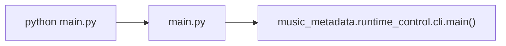

# `main.py`

Source file: [main.py](/C:/Users/Drew/Desktop/MusicScanIter/main.py)

## Purpose

`main.py` is the executable entrypoint for the project. It does not contain application logic beyond importing and calling the CLI entry function.

## What It Does

- imports `main` from `music_metadata.runtime_control.cli`
- executes that function when the file is run as a script

## Usage

Run the project through this file:

```bash
python main.py
```

This is the shell entrypoint for the full workflow.

## Testing Focus

- running `python main.py` should reach `music_metadata.runtime_control.cli.main()` without import errors
- the file should remain a thin wrapper with no duplicated application logic

## Mermaid



## Notes

- This file is intentionally thin.
- All runtime behavior is delegated to `music_metadata.runtime_control.cli`.
