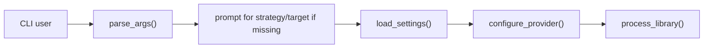

# `music_metadata/runtime_control/cli.py`

Source file: [music_metadata/runtime_control/cli.py](/C:/Users/Drew/Desktop/MusicScanIter/music_metadata/runtime_control/cli.py)

## Purpose

This module is the command-line entry layer. It parses flags, prompts for missing runtime choices, loads settings, configures the model provider, and starts processing.

## Main Functions

- `parse_args()`: defines and parses supported CLI flags
- `_ask_strategy()`: interactive prompt for folder organization strategy
- `build_options(args, settings)`: combines parsed args with prompts and returns `CliOptions`
- `main()`: wires together config loading, provider setup, and service execution

## Flags Defined Here

- `--limit`
- `--apply`
- `--only-missing`
- `--min-confidence`
- `--organize-strategy`
- `--target-dir`
- `--keep-filename`

## Usage

Common invocations:

```bash
python main.py
python main.py --limit 25
python main.py --only-missing
python main.py --min-confidence 0.60
python main.py --organize-strategy artist_album --target-dir C:/Music/Sorted
python main.py --keep-filename
```

When values are omitted, this module prompts for:

- organization strategy
- target directory

## Testing Focus

- each supported flag should parse correctly
- omitting `--organize-strategy` should trigger `_ask_strategy()`
- omitting `--target-dir` should trigger the target directory prompt
- EOF on stdin should fall back to `retain`
- EOF on stdin should fall back to `settings.target_dir`

## Mermaid



## Notes

- If stdin is unavailable, the strategy falls back to `retain`.
- If stdin is unavailable, the target directory falls back to `settings.target_dir`.
- The `--apply` flag is exposed here, but the current service layer always applies changes anyway.
