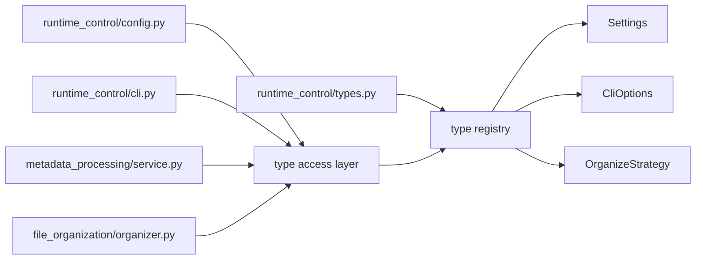

# `music_metadata/runtime_control/types.py`

Source file: [music_metadata/runtime_control/types.py](/C:/Users/Drew/Desktop/MusicScanIter/music_metadata/runtime_control/types.py)

## Purpose

This module defines shared structured types used across the CLI, configuration, and processing pipeline.

## Main Definitions

- `OrganizeStrategy`: literal type for `retain`, `artist_album`, `flat`, and `skip`
- `Settings`: dataclass holding provider, model, API key, source path, target path, and `dry_run`
- `CliOptions`: dataclass holding runtime CLI decisions such as limit, confidence threshold, organization strategy, and rename behavior

## Mermaid

## Notes

- This module is the shared schema layer for the package.
- It contains no side effects or I/O.
- The Mermaid diagram uses a middle layer so each left-side module has only one outgoing edge.
