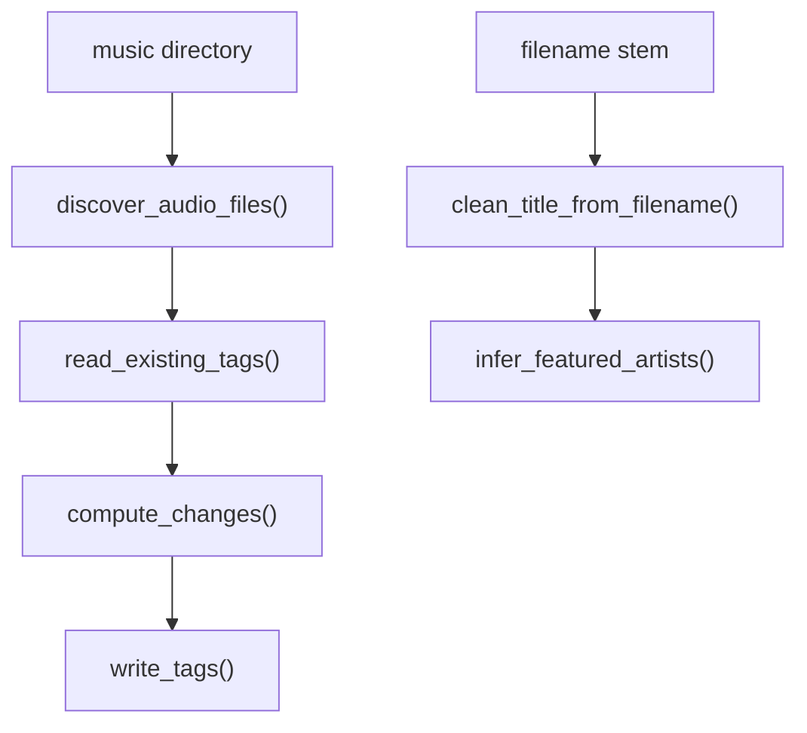

# `music_metadata/metadata_processing/audio.py`

Source file: [music_metadata/metadata_processing/audio.py](/C:/Users/Drew/Desktop/MusicScanIter/music_metadata/metadata_processing/audio.py)

## Purpose

This module handles audio-file discovery, tag reading, change calculation, artist normalization helpers, and tag writing.

## Main Responsibilities

- discover supported files recursively
- derive a clean title guess from filenames
- split artist strings and infer featured artists from titles
- read existing tags with Mutagen
- compute metadata deltas between current tags and model suggestions
- write tags back to files for MP3, M4A, and other Mutagen-supported formats

## Key Functions

- `discover_audio_files()`
- `clean_title_from_filename()`
- `split_artists()`
- `infer_featured_artists()`
- `read_existing_tags()`
- `build_merged_artist()`
- `compute_changes()`
- `write_tags()`
- `has_required_metadata()`

## Supported Formats

- `.mp3`
- `.m4a`
- `.flac`
- `.ogg`
- `.opus`
- `.wav`

## Testing Focus

- discovery should be recursive
- unsupported extensions should be ignored
- `--limit` should reduce the discovered set upstream
- MP3 writes should go through `EasyID3`
- M4A writes should populate the expected MP4 atoms
- generic Mutagen writing should work for other supported formats
- `has_required_metadata()` should only pass when title, artist, and album are all present

## Mermaid

## Notes

- Discovery is recursive because the module uses `Path.rglob("*")`.
- MP3 writes use `EasyID3`.
- M4A writes use explicit MP4 atom keys.
- Other supported formats fall back to generic Mutagen save behavior.
