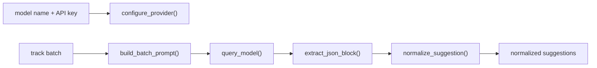

# `music_metadata/metadata_processing/research.py`

Source file: [music_metadata/metadata_processing/research.py](/C:/Users/Drew/Desktop/MusicScanIter/music_metadata/metadata_processing/research.py)

## Purpose

This module owns Gemini integration: client setup, prompt construction, retried model calls, JSON extraction, and normalization of AI output into the internal suggestion schema.

## Main Functions

- `configure_provider(api_key)`: initializes the shared Gemini client
- `build_prompt()`: builds the single-track prompt
- `build_batch_prompt()`: builds the multi-track prompt
- `query_model()`: sends a request with retry behavior
- `extract_json_block()`: extracts JSON from raw model text
- `normalize_suggestion()`: coerces the model payload into the internal normalized shape
- `suggest_metadata()`: single-track suggestion flow
- `suggest_metadata_batch()`: batch suggestion flow used by the service layer

## Testing Focus

- provider configuration should initialize the shared client
- empty model responses should raise an error
- fenced JSON responses should be extracted correctly
- malformed payload shapes should be rejected
- batch output indices should map back to the correct track slot
- featured artists inferred from the title should be merged into normalized output

## Mermaid

## Notes

- `query_model()` retries up to 3 times with exponential backoff.
- The module expects JSON-only responses from the model and strips fenced code blocks when necessary.
- Title-derived featured artists are merged into the normalized suggestion output.
