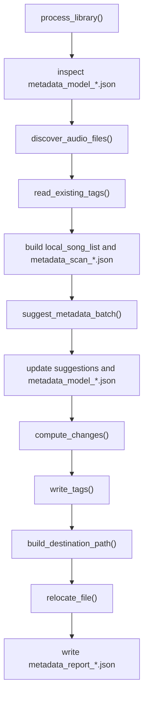

# `music_metadata/metadata_processing/service.py`

Source file: [music_metadata/metadata_processing/service.py](/C:/Users/Drew/Desktop/MusicScanIter/music_metadata/metadata_processing/service.py)

## Purpose

This module is the orchestration layer for the full library-processing workflow.

## Main Responsibilities

- create `.cache/reports/`
- inspect cached model responses
- retrieve local metadata before any model call
- write the pre-model scan report
- send batches to the model
- persist model-enriched metadata after the model call
- compute changes
- write tags
- relocate files
- write model cache output
- write final report batches
- print the end-of-run summary

## Main Functions

- `ensure_reports_dir()`
- `_chunk_records()`
- `write_report_batches()`
- `process_library()`

## Metadata Before Model Use

Before Gemini is called, `process_library()` builds a local view of each candidate track from the filesystem and existing tags.

- `discover_audio_files()` finds the source files under `MUSIC_DIR`
- `read_existing_tags()` retrieves the current embedded metadata from each file
- `has_required_metadata()` is used when `--only-missing` is enabled
- each candidate is stored in `local_song_list` with:
  - `scan_index`
  - `file_path`
  - `existing`
- that local snapshot is written to `metadata_scan_<timestamp>.json`

At this stage, the data is local-only and not yet enriched by the model.

## Metadata After Model Use

After `suggest_metadata_batch()` returns, the module switches from local metadata to model-enriched metadata handling.

- normalized suggestions are attached to the corresponding track
- `scan_report` is updated with the returned `suggestion`
- `all_model_suggestions` is written to `metadata_model_<timestamp>.json`
- `compute_changes()` compares `existing` metadata with the returned suggestion
- the resulting report entries contain both:
  - the original `existing` tags
  - the model `suggestion`
  - the computed `changes`

This is the point where the service begins acting on post-model metadata rather than only retrieved local metadata.

## Runtime Flow

1. create or locate `.cache/reports/`
2. inspect `metadata_model_*.json` for reusable cache state
3. discover audio files from `MUSIC_DIR`
4. read existing tags and build the pre-model candidate list
5. skip cached files and optionally skip fully tagged files
6. write `metadata_scan_*.json`
7. request model suggestions in batches of 50
8. attach the returned suggestions to the tracked items
9. compute tag changes and destination paths
10. write tags and relocate files
11. write `metadata_model_*.json`
12. write `metadata_report_*.json`
13. print the run summary

## Runtime Artifacts

- `metadata_scan_<timestamp>.json`
- `metadata_model_<timestamp>.json`
- `metadata_report_<timestamp>_partNNN.json`

## Testing Focus

- a prior model cache should trigger the reuse prompt
- choosing reuse should skip already cached files
- `--only-missing` should skip tracks with title, artist, and album
- low-confidence suggestions should be skipped
- final reports should be split into batches of 50
- errors should be recorded in report output instead of aborting the full run
- summary counts should reflect applied, changed, and errored items as currently implemented

## Mermaid

## Notes

- Model and report batch sizes are both currently fixed at 50.
- The module prompts the user when a prior model cache is found.
- The current implementation forces `dry_run = False`, so writes and moves occur even without `--apply` and even when `DRY_RUN=true`.
